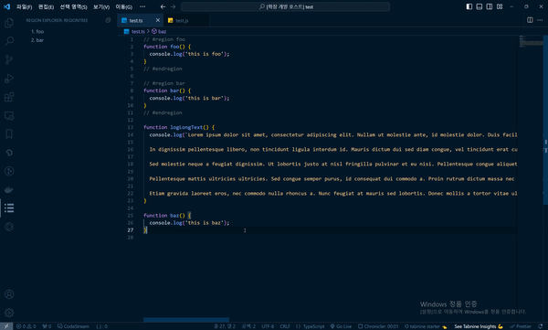

# vscode-region-tree README

#region/#endregion 주석 영역을 트리 구조로 표시하는 vscode 확장 프로그램입니다.😎<br />
(A vscode extension that shows #region/#endregion comment areas as a tree hierarchy.)



## 설치 및 실행

```shell
npm install
```

```
F5 버튼 클릭, 새 vscode window에서 디버깅
```

## 기능

- 짝이 맞지 않은 region, endregion 주석 검출

---

## 커맨드(Commands)

### Wrap with region

선택한 영역을 region 주석으로 래핑합니다.

---

## 설정(Configuration)

커스텀 가능한 설정 목록입니다. (`기본 값`)

**vscodeRegionTree.enableJumpToMismatchedRegion (`false`)**<br />

파일 저장 시 region, endregion의 짝이 맞지 않을 경우 해당 라인으로 이동하는 기능을 활성화합니다.

## 사용

- typescript

## TODO

- [ ] fold/unfold all regions 커맨드 추가하기